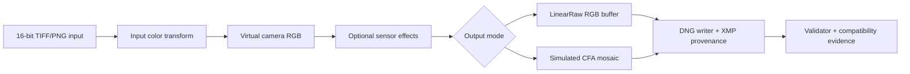

# Architecture Demo

This demo shows the intended application interface for current image2dng phases:

1. A rendered or scene-linear RGB image enters the color pipeline.
2. Optional synthetic sensor effects are applied with an explicit deterministic seed.
3. The output writer emits either three-channel `LinearRaw` or single-channel simulated CFA DNG.
4. XMP records synthetic provenance, selected raw mode, CFA pattern when present, and sensor-effect parameters when present.
5. The validator checks DNG structure, mode-specific tags, XMP semantics, and optional local smoke tools.



## Demo Samples

Generate deterministic sample outputs:

```powershell
uv run python scripts/generate_demo_samples.py --output-dir demo-output
uv run image2dng validate demo-output/demo-linearraw.dng --no-smoke
uv run image2dng validate demo-output/demo-cfa-rggb.dng --no-smoke
uv run image2dng validate demo-output/demo-cfa-rggb-noisy.dng --no-smoke
```

The script creates:

- `demo-gradient.tif`: deterministic RGB source image.
- `demo-linearraw.dng`: baseline LinearRaw output.
- `demo-cfa-rggb.dng`: simulated RGGB CFA output.
- `demo-cfa-rggb-noisy.dng`: simulated RGGB CFA output with deterministic simple sensor effects.

The samples are generated locally and should not be committed as binary fixtures.

For the staged visual-demo workflow, image category allocation, and contact-sheet tasks, see [docs/i18n/zh-TW/demo-visualization-workflow.md](i18n/zh-TW/demo-visualization-workflow.md).

## Application Scenarios

- **AI image provenance research**: preserve prompt hash, model metadata, and synthetic camera semantics in a DNG container.
- **RAW processor compatibility testing**: compare how tools handle LinearRaw versus simulated CFA DNGs.
- **Pipeline integration**: call `image2dng.convert()` directly from a Python workflow instead of shelling out to the CLI.
- **Regression demos**: regenerate deterministic samples after changes and validate them with `image2dng validate`.

## Sensor-Effect Semantics

Sensor effects are intentionally simple and synthetic:

- `shot_noise` applies signal-dependent Gaussian variation.
- `read_noise` applies additive Gaussian variation.
- `row_noise` applies row-level offset variation.
- `sensor_effect_seed` makes the output reproducible.

These parameters are useful for demos and compatibility testing. They are not a physical camera model and must not be represented as real sensor capture metadata.
