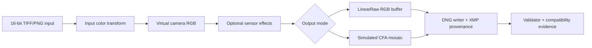

# Architecture Demo

This demo shows the intended application interface for current image2dng phases:

1. A rendered or scene-linear RGB image enters the color pipeline.
2. Optional synthetic sensor effects are applied with an explicit deterministic seed.
3. The output writer emits either three-channel `LinearRaw` or single-channel simulated CFA DNG.
4. XMP records synthetic provenance, selected raw mode, CFA pattern when present, and sensor-effect parameters when present.
5. The validator checks DNG structure, mode-specific tags, XMP semantics, and optional local smoke tools.

The newer RAW-native node batch treats DNG as the primary generation artifact and renders JPEG previews from generated RAW buffers. It is the recommended fast path for testing the node-style direction before integrating a larger generation runtime.



## Demo Samples

Generate deterministic sample outputs:

```powershell
uv run python scripts/generate_demo_samples.py --output-dir demo-output
uv run python scripts/generate_raw_native_batch.py --output-dir demo-output/raw-native-node-batch
uv run python scripts/generate_visual_demo.py --output-dir demo-output/visual-demo
uv run python scripts/verify_development_baseline.py --output-dir demo-output/development-baseline
uv run python scripts/generate_compatibility_evidence.py --output-dir demo-output/compatibility-evidence
uv run python scripts/generate_demo_review_bundle.py --output-dir demo-output/review-bundle
uv run image2dng validate demo-output/demo-linearraw.dng --no-smoke
uv run image2dng validate demo-output/demo-cfa-rggb.dng --no-smoke
uv run image2dng validate demo-output/demo-cfa-rggb-noisy.dng --no-smoke
```

The script creates:

- `demo-gradient.tif`: deterministic RGB source image.
- `demo-linearraw.dng`: baseline LinearRaw output.
- `demo-cfa-rggb.dng`: simulated RGGB CFA output.
- `demo-cfa-rggb-noisy.dng`: simulated RGGB CFA output with deterministic simple sensor effects.

The samples are generated locally and should not be committed as binary fixtures.

The RAW-native node batch creates:

- `inputs/*-scene-linear.tif`
- `raw/*-linearraw.dng`
- `raw/*-cfa-rggb.dng`
- `jpeg/*-linearraw.jpg`
- `jpeg/*-cfa-rggb.jpg`
- `validation/*.json`
- `manifests/raw-native-node-batch.json`
- `manifests/sample-index.json`

The development baseline verifier writes `verification-report.json` with command results, artifact paths, JPEG dimensions, validation status, and sample index status.

The demo review bundle generator reruns the visual demo, RAW-native node batch, development baseline, and compatibility evidence into a work directory, then writes a portable review package at `demo-output/review-bundle/`. Use `index.md` as the human review entry point and `review-bundle-report.json` as the machine-readable artifact manifest with bundle-relative paths, byte counts, and SHA-256 checksums.

Generate staged visual demo outputs with PNG previews, validation JSON, and contact sheets:

```powershell
uv run python scripts/generate_visual_demo.py --output-dir demo-output/visual-demo
```

The visual generator currently creates synthetic, redistributable demo inputs for:

- standard chart and tonal gradients;
- skin-tone panels and simple portrait shapes;
- everyday object and material samples.

The visual demo manifest uses `image2dng.visual_demo_manifest.v1` and records every DNG, preview, validation JSON, and contact sheet. The required contact sheets are:

- `contact-sheets/phase-overview.png`: source, LinearRaw, CFA, LinearRaw noisy, and CFA noisy columns.
- `contact-sheets/cfa-pattern-comparison.png`: RGGB, BGGR, GRBG, and GBRG CFA pattern previews.
- `contact-sheets/sensor-effects-comparison.png`: none, shot, read, row, and combined sensor-effect previews.

JPEG printer evaluation charts can be used as local reference assets, but they require preprocessing into supported 16-bit TIFF/PNG inputs before conversion.

Include local 16-bit ProPhoto TIFF assets:

```powershell
uv run python scripts/generate_visual_demo.py `
  --output-dir demo-output `
  --prophoto-tiff "demo-output/PrinterEvaluationImage_V002_ProPhoto.tiff" `
  --prophoto-tiff "demo-output/03. Skin Tone_ProPhoto.tiff"
```

For the staged visual-demo workflow, image category allocation, and contact-sheet tasks, see [docs/i18n/zh-TW/demo-visualization-workflow.md](i18n/zh-TW/demo-visualization-workflow.md).

## Application Scenarios

- **AI image provenance research**: preserve prompt hash, model metadata, and synthetic camera semantics in a DNG container.
- **RAW processor compatibility testing**: compare how tools handle LinearRaw versus simulated CFA DNGs.
- **Pipeline integration**: call `image2dng.convert()` directly from a Python workflow instead of shelling out to the CLI.
- **Regression demos**: regenerate deterministic samples after changes and validate them with `image2dng validate`.

## Sensor-Effect Semantics

Sensor effects are intentionally simple and synthetic:

- `shot_noise` applies signal-dependent Gaussian variation.
- `read_noise` applies additive Gaussian variation.
- `row_noise` applies row-level offset variation.
- `sensor_effect_seed` makes the output reproducible.

These parameters are useful for demos and compatibility testing. They are not a physical camera model and must not be represented as real sensor capture metadata.
