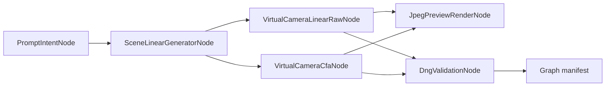

# Image-to-DNG RAW Generator Design

Traditional Chinese source manuscript: [docs/i18n/zh-TW/design-overview.md](i18n/zh-TW/design-overview.md)

## Research background

This project currently leans more toward engineering implementation and format design than reproducing any single paper. Three external references are still especially useful for framing the problem space:

1. **RawGen: Learning Camera Raw Image Generation**  
   <https://arxiv.org/abs/2604.00093>  
   This paper treats both `text-to-raw` and `sRGB-to-raw inversion` as worthwhile research problems, which supports the idea that moving from existing images or generation pipelines back toward a camera-centric linear representation is an active topic. For this project, it primarily supports the problem definition; the current MVP does not aim to reproduce its diffusion method.

2. **DxO Linear DNG background**  
   <https://www.dxo.com/technology/linear-dng/>  
   DxO's Linear DNG explanation is not a research paper, but it is still useful because it reflects how Linear DNG functions in a real photography workflow: a file can already contain some linear processing and still preserve meaningful RAW editing flexibility. That supports this project's decision to start with a `LinearRaw` MVP rather than jumping directly to a faux-CFA path. DxO's scenario is still different from this project, because DxO exports Linear DNG from real camera RAW files while this project starts from rendered RGB or scene-linear imagery.

3. **Linear DNG overview (Kronometric)**  
   <https://kronometric.org/phot/processing/DNG/Linear%20DNG.htm>  
   This reference is older, but still helpful for concept clarification. It explains that Linear DNG does not have to carry only traditional unprocessed sensor data; it can also carry linearized multi-channel image data. For this project, that helps validate the format-level idea of an honest, parseable synthetic LinearRaw DNG.

Taken together, these references support different aspects of the project:

- RawGen supports the claim that the problem itself is worth studying.
- DxO supports the claim that Linear DNG is a meaningful delivery format in real workflows.
- Kronometric supports the claim that Linear DNG can conceptually hold a non-traditional linear image representation.

That keeps the design direction grounded in a few rules:

- stabilize DNG/TIFF container correctness first;
- write synthetic provenance and simulated camera metadata honestly;
- use `LinearRaw` as the interoperable MVP first;
- keep CFA as an explicit opt-in simulated mode;
- leave noise, depth, semantic masks, and more research-oriented inverse-ISP / raw-generation paths outside the core LinearRaw MVP.

## RAW-native node pipeline direction

The project is expanding from one-shot conversion into a RAW-native generation pipeline. In this model, DNG is the primary generated artifact, while JPEG/PNG outputs are previews or delivery renders produced from the generated RAW buffer.

The current implementation keeps the first node graph inside this repository instead of making ComfyUI the first core runtime dependency. That keeps DNG semantics, XMP provenance, validation, and synthetic camera rules next to the tested core code. The ComfyUI / Stable Diffusion bridge has been split into the sibling project `../image-to-raw-comfyui-sd-bridge/`; it owns workflow metadata, checkpoint/sampler/scheduler semantics, and wraps the `image2dng` core pipeline rather than replacing it.

Current minimal graph:



First runnable batch:

```powershell
uv run python scripts/generate_raw_native_batch.py --output-dir demo-output/raw-native-node-batch
```

This emits scene-linear TIFF intermediates, LinearRaw DNG files, simulated CFA DNG files, JPEG previews, validation JSON, and a graph manifest. See [docs/i18n/en/raw-native-node-pipeline.md](i18n/en/raw-native-node-pipeline.md) and [docs/i18n/zh-TW/raw-native-node-pipeline.md](i18n/zh-TW/raw-native-node-pipeline.md).

## LinearRaw MVP scope

The MVP goal is to convert 16-bit TIFF/PNG or scene-linear RGB images into valid, parseable, honestly labeled DNG files. The main image IFD uses:

- `PhotometricInterpretation = LinearRaw`
- `SamplesPerPixel = 3`
- `BitsPerSample = 16,16,16`
- `Compression = 1` uncompressed
- `UniqueCameraModel = "Synthetic Camera v1"`

Input flow:

1. Read RGB or grayscale 16-bit TIFF/PNG.
2. Apply the inverse sRGB OETF for `srgb`; treat the other input spaces as scene-linear.
3. Treat `linear-rec709` and `srgb` as the virtual camera native RGB space.
4. Convert `acescg` and `xyz` through XYZ into the virtual camera native RGB space.
5. Apply the ROMM-style 1.8 inverse transfer for `prophoto-rgb`, adapt from D50 to D65 with Bradford, then convert into the virtual camera native RGB space.
6. Add the black-level offset and clip to white level.
7. Quantize into a 16-bit LinearRaw buffer.

This MVP does not attempt to impersonate a real camera file. It produces a synthetic LinearRaw DNG.

## Why not start with CFA

CFA DNG needs decisions about Bayer pattern, CFA plane color, pre-demosaic aliasing behavior, black borders or masked pixels, fixed-pattern noise, shot/read noise, white balance, and color-matrix consistency. If the project starts by reverse-engineering CFA from rendered RGB, it too easily creates files that look RAW-like without being semantically honest or stable.

LinearRaw first guarantees a few important things:

- the DNG/TIFF container is parseable;
- RAW software can inspect the linear main image and basic profile;
- AI metadata does not interfere with main-image readability;
- the proof-of-concept phase does not have to overclaim about CFA sensor simulation.

## Simulated CFA mode

Phase 2 introduces an explicit `--mode cfa` path for compatibility and workflow research. This mode converts the virtual camera RGB buffer into a single-channel 2x2 Bayer mosaic. Supported patterns are:

- `rggb`
- `bggr`
- `grbg`
- `gbrg`

The CFA DNG writes:

- `PhotometricInterpretation = 32803` (`ColorFilterArray`)
- `SamplesPerPixel = 1`
- `CFARepeatPatternDim = 2,2`
- `CFAPattern` for the selected Bayer pattern
- `CFAPlaneColor = 0,1,2`
- `BlackLevelRepeatDim = 2,2`

This is still synthetic data. The XMP packet records `xmpAI:rawMode="cfa"` and `xmpAI:cfaPattern`, and camera parameters remain marked as simulated. CFA mode does not add sensor noise by default, does not add optical black borders, and does not claim to represent a real camera sensor capture.

## Synthetic sensor effects

Phase 3 adds optional deterministic sensor-effect controls for demos and compatibility experiments:

- `shot_noise`: signal-dependent Gaussian variation.
- `read_noise`: additive Gaussian variation.
- `row_noise`: row-level offset variation.
- `sensor_effect_seed`: deterministic seed for reproducible sample generation.

These effects are applied in virtual camera RGB before quantization or CFA mosaicing. XMP records `xmpAI:sensorNoiseModel="synthetic-simple-v1"` plus the enabled parameters. The model is intentionally simple; it is not a physical sensor simulator and should not be used to impersonate real camera behavior.

## DNG tag layout

The default layout is currently `preview-subifd`: IFD0 stores a JPEG-compressed RGB preview and `SubIFDs` points at the main raw image IFD. The raw SubIFD retains independently readable raw image data and full DNG metadata. When compatibility regression work needs it, the older `single-raw-ifd` layout is still available.

IFD0 preview:

| Tag | Value |
| --- | --- |
| `NewSubFileType` | `1` |
| `Compression` | `7` (`JPEG`) |
| `PhotometricInterpretation` | `2` (`RGB`) |
| `BitsPerSample` | `8,8,8` |
| `SamplesPerPixel` | `3` |
| `SubIFDs` | points to the raw image IFD |
| `Make` / `Model` | `image2dng` / `Synthetic Camera v1` |
| `XMP` | custom AI provenance packet |

Raw SubIFD:

| Tag | Value |
| --- | --- |
| `NewSubFileType` | `0` |
| `DNGVersion` | `1.4.0.0` |
| `DNGBackwardVersion` | `1.1.0.0` |
| `Make` | `image2dng` |
| `Model` | `Synthetic Camera v1` |
| `UniqueCameraModel` | `Synthetic Camera v1` |
| `Orientation` | `1` |
| `ImageWidth` / `ImageLength` | determined by the input image |
| `BitsPerSample` | `16,16,16` |
| `SamplesPerPixel` | `3` |
| `Compression` | `1` |
| `PhotometricInterpretation` | `34892` (`LinearRaw`) |
| `BlackLevelRepeatDim` | `1,1` |
| `BlackLevel` | `512,512,512` |
| `WhiteLevel` | `65535,65535,65535` |
| `DefaultScale` | `1/1, 1/1` |
| `ActiveArea` | `0,0,height,width` |
| `DefaultCropOrigin` | `0,0` |
| `DefaultCropSize` | `width,height` |
| `ColorMatrix1` | virtual camera XYZ-to-native matrix |
| `CalibrationIlluminant1` | `21` (`D65`) |
| `AsShotNeutral` | CCT-derived neutral, normalized to green |
| `RawDataUniqueID` | 16-byte deterministic identifier derived from raw image data |
| `Software` | `image2dng 0.1.0` |
| `XMP` | custom AI provenance packet |

MakerNote is intentionally omitted.

## XMP AI metadata schema

Namespace:

```text
https://example.org/ns/xmp/ai/1.0/
```

MVP fields:

- `xmpAI:provenanceType="synthetic"`
- `xmpAI:modelName`
- `xmpAI:modelVersion`
- `xmpAI:promptHash`
- `xmpAI:sceneDescription`
- `xmpAI:lighting`
- `xmpAI:weather`
- `xmpAI:cameraParametersAreSimulated="True"`
- `xmpAI:simulatedISO`
- `xmpAI:simulatedWhiteBalanceKelvin`

Plaintext prompt is not written by default. The CLI only embeds it when the user explicitly passes `--prompt-plaintext`.

## Validation plan

`image2dng validate output.dng` checks:

- required DNG tags are present;
- `PhotometricInterpretation` is LinearRaw;
- XMP parses as XML;
- synthetic provenance and the simulated camera flag exist;
- black and white levels are sane;
- image dimensions match the decoded buffer;
- raw-data byte count matches dimensions;
- MakerNote is absent;
- optional local smoke tools run when available.
