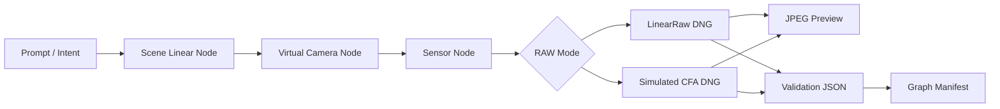

# RAW-native Node Generation Pipeline

This note records the project direction for moving `image2dng` from "convert an existing image into synthetic DNG" toward "generate synthetic RAW/DNG as the native output of an AI image pipeline."

## Decision

Build the minimal node-style core pipeline inside this repository first instead of installing ComfyUI as the first core dependency.

Rationale:

- RAW/DNG semantics, XMP provenance, synthetic camera labeling, and validation contracts are the core responsibility of this project. They should stay testable, versioned, and regression-safe inside this repository.
- The existing `convert()`, DNG writer, validator, and sensor-effect code already provide enough foundation to split the flow into graph artifacts.
- ComfyUI is a strong visual orchestration and model ecosystem, but making it the first core dependency would couple RAW semantics, model workflow, and UI extension lifecycle too early.
- The first validation target is to emit DNG, JPEG previews, validation JSON, and a graph manifest. That does not require a full diffusion runtime yet.

ComfyUI remains the Phase 2 integration target. Its official documentation describes custom-node and CLI management paths, which fit a later wrapper around this repository's core pipeline:

- <https://docs.comfy.org/development/core-concepts/custom-nodes>
- <https://docs.comfy.org/comfy-cli/getting-started>
- <https://github.com/Comfy-Org/ComfyUI>

## Target Flow



## Artifact Contract

Each batch emits at least:

- `inputs/*-scene-linear.tif`: scene-linear RGB intermediate image.
- `raw/*-linearraw.dng`: three-channel synthetic LinearRaw DNG.
- `raw/*-cfa-rggb.dng`: single-channel simulated RGGB CFA DNG.
- `jpeg/*-linearraw.jpg`: JPEG preview rendered from the LinearRaw DNG.
- `jpeg/*-cfa-rggb.jpg`: false-color JPEG preview rendered from the CFA DNG.
- `validation/*.json`: validator results.
- `manifests/raw-native-node-batch.json`: node flow, inputs, outputs, parameters, and validation summary.

## Current Implementation

```powershell
uv run python scripts/generate_raw_native_batch.py --output-dir demo-output/raw-native-node-batch
```

Current nodes:

- `PromptIntentNode`
- `SceneLinearGeneratorNode`
- `VirtualCameraLinearRawNode`
- `VirtualCameraCfaNode`
- `JpegPreviewRenderNode`
- `DngValidationNode`

The current scene generator is deterministic and procedural, not the final AI diffusion model. This is intentional: Phase 1 validates the RAW-native pipeline semantics, manifest, DNG parseability, and JPEG preview delivery path before integrating a heavier image generation runtime.

## Next Steps

1. Stabilize `raw-native-node-batch.json` as a tested schema contract.
2. Support an external scene-linear image producer as the future AI model adapter boundary.
3. Decide preview IFD versus sidecar preview policy.
4. Prototype a ComfyUI custom node that accepts prompt or scene-linear tensor input and returns DNG path, JPEG path, and manifest.
5. Add ComfyUI installation and smoke workflow docs after the custom node is stable.
