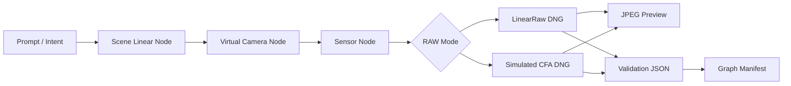

# RAW-native Node Generation Pipeline

This note records the project direction for moving `image2dng` from "convert an existing image into synthetic DNG" toward "generate synthetic RAW/DNG as the native output of an AI image pipeline."

## Decision

Build the minimal node-style core pipeline inside this repository first instead of installing ComfyUI as the first core dependency. The ComfyUI / Stable Diffusion bridge now lives in a sibling project, while this core repository keeps the generic external scene-linear boundary.

Rationale:

- RAW/DNG semantics, XMP provenance, synthetic camera labeling, and validation contracts are the core responsibility of this project. They should stay testable, versioned, and regression-safe inside this repository.
- The existing `convert()`, DNG writer, validator, and sensor-effect code already provide enough foundation to split the flow into graph artifacts.
- ComfyUI is a strong visual orchestration and model ecosystem, but it should wrap the core pipeline from a separate bridge project so RAW semantics, model workflow, and UI extension lifecycle do not become coupled too early.
- The first validation target is to emit DNG files with IFD0 JPEG previews, sidecar JPEG previews, validation JSON, and a graph manifest; that core validation scope does not depend on a full diffusion runtime.

ComfyUI / Stable Diffusion integration lives in an external sibling bridge project; this core repository does not vendor or install that bridge:

- `image-to-raw-comfyui-sd-bridge`

ComfyUI documentation remains useful for the bridge-side custom-node and CLI integration boundary:

- <https://docs.comfy.org/development/core-concepts/custom-nodes>
- <https://docs.comfy.org/comfy-cli/getting-started>
- <https://github.com/Comfy-Org/ComfyUI>

## Target Flow



## External Scene-Linear Producer Boundary

External renderers, AI generators, simulation engines, and ComfyUI nodes in the bridge project do not need to understand the DNG writer directly. They can hand off scene-linear TIFF/PNG files and manifests, then this repository owns the virtual camera step, sensor effects, DNG layout, sidecar previews, validation, and manifests.

Minimal CLI:

```powershell
uv run python scripts/generate_raw_native_batch.py `
  --output-dir demo-output/external-scene-linear-batch `
  --scene-linear path\to\scene-linear.tif
```

The ComfyUI / Stable Diffusion offline importer moved to the bridge project. The CLI provided by that bridge reads ComfyUI output PNG `prompt` / `workflow` metadata, converts the image into a 16-bit TIFF handoff artifact, and writes an external scene manifest:

```powershell
uv run image2dng-comfyui-import `
  path\to\ComfyUI_00002_.png `
  --output-dir demo-output/comfyui-import `
  --run-pipeline
```

This path is provided by the external bridge project and intentionally does not launch ComfyUI, download models, or install custom nodes. Typical ComfyUI PNG outputs should be imported as `srgb`; use `linear-rec709` or another linear-light input space only when the workflow is known to emit scene-linear TIFF.

The bridge importer writes `producer_metadata` and `producer_metadata_manifest` into the external scene manifest. The RAW-native external batch copies the metadata sidecar and records `producer_metadata_artifacts` in the batch manifest / sample index, keeping the ComfyUI workflow summary traceable to the output DNGs. Producer metadata is preserved for traceability only and does not modify raw sample values; deterministic pixel changes live only in the explicit opt-in semantic reaction path.

For multiple images or per-image metadata, use an `image2dng.external_scene_linear_sources.v1` manifest:

```json
{
  "schema": "image2dng.external_scene_linear_sources.v1",
  "scenes": [
    {
      "slug": "renderer-frame-001",
      "path": "renderer-frame-001.tif",
      "input_space": "linear-rec709",
      "producer": "external renderer",
      "prompt": "studio material test",
      "description": "scene-linear output from an upstream generator",
      "lighting": "virtual D65 studio",
      "semantic_manifest": "renderer-frame-001.semantic.json"
    }
  ]
}
```

`semantic_manifest` is a currently implemented semantic sidecar extension point. When the sidecar uses `image2dng.semantic_scene.v1`, the pipeline validates it before DNG generation, copies the sidecar, copies resolvable local assets, and records a validation summary in the batch manifest and sample index. By default, the implementation still does not convert semantic information into raw sample values.

When the external scene manifest explicitly sets `apply_semantic_reaction: true`, the pipeline enables `semantic-reaction-chain-v1` helpers. It currently applies `region-exposure-mask-v1` to use region masks and `exposure_bias_ev` for deterministic EV modulation on 16-bit scene-linear RGB input, then applies `highlight-clipping-policy-v1` highlight shoulder mapping. This only supports `linear-rec709`, `acescg`, and `xyz`; encoded `srgb` or `prophoto-rgb` inputs cannot apply the reaction directly. See [Semantic Scene Sidecar Contract v1](semantic-scene-sidecar-contract.md) for the detailed contract.

## Artifact Contract

Each batch emits at least:

- `inputs/*-scene-linear.tif`: scene-linear RGB intermediate image.
- `raw/*-linearraw.dng`: three-channel synthetic LinearRaw DNG, by default with an IFD0 JPEG preview and Raw SubIFD.
- `raw/*-cfa-rggb.dng`: single-channel simulated RGGB CFA DNG, by default with an IFD0 false-color JPEG preview and Raw SubIFD.
- `jpeg/*-linearraw.jpg`: sidecar JPEG preview rendered from the LinearRaw DNG raw page.
- `jpeg/*-cfa-rggb.jpg`: sidecar false-color JPEG preview rendered from the CFA DNG raw page.
- `validation/*.json`: validator results.
- `manifests/raw-native-node-batch.json`: node flow, inputs, outputs, parameters, and validation summary.
- With producer metadata, the batch manifest and sample index record `producer_metadata` and `producer_metadata_artifacts`; this is sidecar/manifest preservation, not DNG payload embedding.
- With a semantic sidecar, the batch manifest records `semantic_artifacts`, `semantic_contract`, `semantic_to_raw_status`, and `semantic_validation`; the sample index records `semantic_contract`, `semantic_to_raw_status`, and `semantic_validation`.
- When semantic reaction is enabled, the batch manifest and sample index record a `semantic_reaction` summary; the reaction-applied input is preserved as `inputs/*-semantic-reaction.tif`.

## Current Implementation

```powershell
uv run python scripts/generate_raw_native_batch.py --output-dir demo-output/raw-native-node-batch
```

Current nodes:

- `PromptIntentNode`
- `SceneLinearGeneratorNode`
- `ExternalSceneLinearInputNode`: appears only when external scene-linear input is used
- `VirtualCameraLinearRawNode`
- `VirtualCameraCfaNode`
- `JpegPreviewRenderNode`
- `DngValidationNode`

The current scene generator is deterministic and procedural, not the final AI diffusion model. This is intentional: Phase 1 validates the RAW-native pipeline semantics, manifest, DNG parseability, embedded preview layout, and sidecar JPEG preview delivery path before integrating a heavier image generation runtime.

`raw-native-node-batch.json` and `sample-index.json` are now stabilized as focused test contracts. The demo review bundle also collects RAW-native DNG files, JPEG previews, validation JSON, manifests, and compatibility evidence for external review:

```powershell
uv run python scripts/generate_demo_review_bundle.py --output-dir demo-output/review-bundle
```

## Boundary Notes

- `preview-subifd` layout behavior in RAW tools should be validated through compatibility evidence; it remains a format experiment, not a full Adobe compatibility claim.
- Semantic sidecar reaction describes only how deterministic helpers map raw values; it does not claim a completed photon/sensor-response model.
- ComfyUI custom nodes, ComfyUI installation, model downloads, and smoke workflows belong in the external bridge project; the core repository keeps only the generic external manifest contract.
