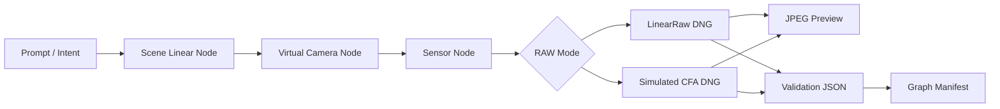

# RAW-native Node Generation Pipeline

This note records the project direction for moving `image2dng` from "convert an existing image into synthetic DNG" toward "generate synthetic RAW/DNG as the native output of an AI image pipeline."

## Decision

Build the minimal node-style core pipeline inside this repository first instead of installing ComfyUI as the first core dependency.

Rationale:

- RAW/DNG semantics, XMP provenance, synthetic camera labeling, and validation contracts are the core responsibility of this project. They should stay testable, versioned, and regression-safe inside this repository.
- The existing `convert()`, DNG writer, validator, and sensor-effect code already provide enough foundation to split the flow into graph artifacts.
- ComfyUI is a strong visual orchestration and model ecosystem, but making it the first core dependency would couple RAW semantics, model workflow, and UI extension lifecycle too early.
- The first validation target is to emit DNG files with IFD0 JPEG previews, sidecar JPEG previews, validation JSON, and a graph manifest. That does not require a full diffusion runtime yet.

ComfyUI remains the Phase 2 integration target. Its official documentation describes custom-node and CLI management paths, which fit a later wrapper around this repository's core pipeline:

- <https://docs.comfy.org/development/core-concepts/custom-nodes>
- <https://docs.comfy.org/comfy-cli/getting-started>
- <https://github.com/Comfy-Org/ComfyUI>

## Target Flow



## External Scene-Linear Producer Boundary

External renderers, AI generators, simulation engines, and future ComfyUI nodes do not need to understand the DNG writer directly. They can hand off scene-linear TIFF/PNG files, then this repository owns the virtual camera step, sensor effects, DNG layout, sidecar previews, validation, and manifests.

Minimal CLI:

```powershell
uv run python scripts/generate_raw_native_batch.py `
  --output-dir demo-output/external-scene-linear-batch `
  --scene-linear path\to\scene-linear.tif
```

For multiple images or per-image metadata, use an `image2dng.external_scene_linear_sources.v1` manifest:

```json
{
  "schema": "image2dng.external_scene_linear_sources.v1",
  "scenes": [
    {
      "slug": "renderer-frame-001",
      "path": "renderer-frame-001.tif",
      "input_space": "linear-rec709",
      "producer": "external renderer",
      "prompt": "studio material test",
      "description": "scene-linear output from an upstream generator",
      "lighting": "virtual D65 studio",
      "semantic_manifest": "renderer-frame-001.semantic.json"
    }
  ]
}
```

`semantic_manifest` is a deliberate next-stage hook: the current implementation copies it and records it in the batch manifest, but does not convert semantic information into raw sample values. The more valuable long-term direction is for the upstream generator to emit scene semantics during generation, then for this project to map semantics, material, lighting, and sensor model data into photon/sensor-response values stored as RAW.

## Artifact Contract

Each batch emits at least:

- `inputs/*-scene-linear.tif`: scene-linear RGB intermediate image.
- `raw/*-linearraw.dng`: three-channel synthetic LinearRaw DNG, by default with an IFD0 JPEG preview and Raw SubIFD.
- `raw/*-cfa-rggb.dng`: single-channel simulated RGGB CFA DNG, by default with an IFD0 false-color JPEG preview and Raw SubIFD.
- `jpeg/*-linearraw.jpg`: sidecar JPEG preview rendered from the LinearRaw DNG raw page.
- `jpeg/*-cfa-rggb.jpg`: sidecar false-color JPEG preview rendered from the CFA DNG raw page.
- `validation/*.json`: validator results.
- `manifests/raw-native-node-batch.json`: node flow, inputs, outputs, parameters, and validation summary.

## Current Implementation

```powershell
uv run python scripts/generate_raw_native_batch.py --output-dir demo-output/raw-native-node-batch
```

Current nodes:

- `PromptIntentNode`
- `SceneLinearGeneratorNode`
- `ExternalSceneLinearInputNode`: appears only when external scene-linear input is used
- `VirtualCameraLinearRawNode`
- `VirtualCameraCfaNode`
- `JpegPreviewRenderNode`
- `DngValidationNode`

The current scene generator is deterministic and procedural, not the final AI diffusion model. This is intentional: Phase 1 validates the RAW-native pipeline semantics, manifest, DNG parseability, embedded preview layout, and sidecar JPEG preview delivery path before integrating a heavier image generation runtime.

`raw-native-node-batch.json` and `sample-index.json` are now stabilized as focused test contracts. The demo review bundle also collects RAW-native DNG files, JPEG previews, validation JSON, manifests, and compatibility evidence for external review:

```powershell
uv run python scripts/generate_demo_review_bundle.py --output-dir demo-output/review-bundle
```

## Next Gate

1. Continue validating the `preview-subifd` layout with representative samples in RAW tools; this is a format experiment, not a full Adobe compatibility claim.
2. Expand the semantic sidecar contract and define how semantics, material, lighting, mask, and depth data enter photon/sensor-response mapping.
3. After the DNG tag contract and compatibility evidence are stable, prototype a ComfyUI custom node that accepts prompt, scene-linear tensor, and semantic sidecar input and returns DNG path, sidecar JPEG path, and manifest.
4. Add ComfyUI installation and smoke workflow docs after the custom node is stable.
