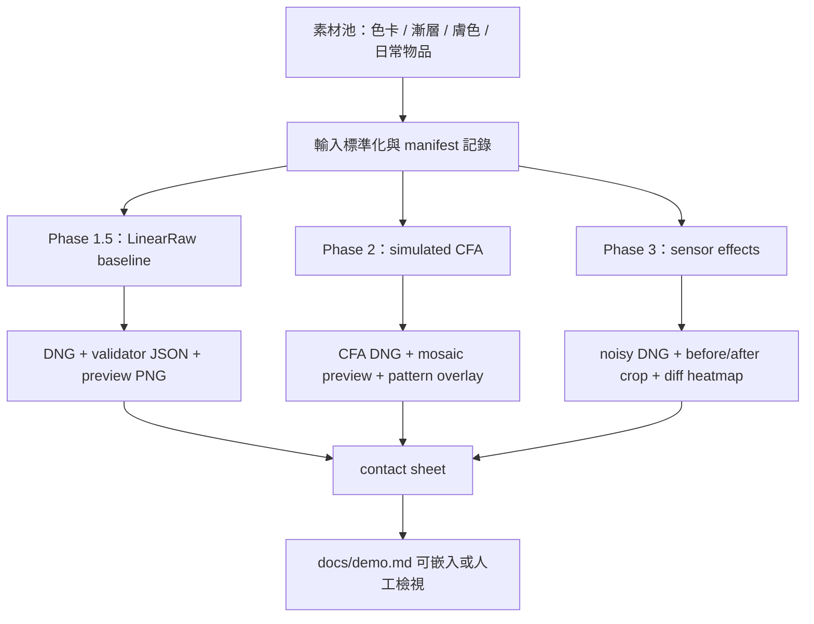

# DEMO 視覺化流程與樣張任務設計

English public baseline: [docs/demo.md](../../demo.md)

本文件定義 `image2dng` 每個開發階段都應產出的可視化 demo。目標不是只產生 DNG，而是讓每個功能階段都有「可看、可比、可驗證」的影像證據。

## 素材池

### A. 標準色卡與階調漸層

用途：驗證色彩、階調、black/white level、clipping、CFA channel mapping、noise visibility。

來源：

- 使用者本機圖卡：
  - `PrinterEvaluationImage_V002_sRGB.jpg`
  - `PrinterEvaluationImage_V002_AdobePhoto.jpg`
- 專案動態產生圖：
  - RGB channel ramp
  - neutral grayscale ramp
  - near-black patches
  - near-white patches
  - saturated RGB/CMY patches

注意：本機圖卡作為 external demo asset，不 commit binary 或私人絕對路徑到 repo。若需要公開 demo，應改用可授權素材或由 script 生成替代圖。

### B. 人像膚色

用途：觀察白平衡、膚色偏移、noise texture、CFA 對細節與色彩的影響。

建議分配：

- 淺膚色、中膚色、深膚色各至少一張。
- 正面臉、側光臉、低光臉各至少一張。
- 優先使用可授權公開素材或生成式合成素材，不使用未授權真人照片。

### C. 日常物品與材質

用途：建立接近實際應用的視覺說服力。

建議類別：

- 食物：水果、烘焙、飲品，測紅色/黃色/高飽和。
- 布料：深色布、牛仔布、細紋材質，測 noise 與細節。
- 金屬/塑膠/玻璃：高光、反射、透明材質。
- 植物/自然：葉片、天空、夕陽、水面，測漸層與色彩壓縮。
- 電子產品/印刷品：細線、文字、黑白邊界，測 demosaic 與銳利度。

### D. 技術壓力圖

用途：把功能差異明確視覺化。

- CFA 2x2 pattern overlay。
- CFA raw mosaic grayscale preview。
- LinearRaw vs CFA false-color comparison。
- Sensor effects before/after crop。
- Noise difference heatmap。
- Validation result summary panel。

## 階段輸出矩陣

| 階段 | 功能焦點 | 必備輸入 | 必備輸出 | 視覺證據 |
| --- | --- | --- | --- | --- |
| Phase 1.5 | LinearRaw baseline / validator / API | 標準色卡、RGB ramp、灰階 ramp | `linearraw.dng`、validator JSON、preview PNG | source vs LinearRaw preview、灰階連續性、色塊對照 |
| Phase 2 | simulated CFA mode | 色卡、細節材質、文字/線條、RGB ramp | `cfa-rggb.dng`、`cfa-bggr.dng`、CFA validator JSON | CFA mosaic preview、2x2 pattern overlay、LinearRaw/CFA 對照 |
| Phase 3 | synthetic sensor effects / demo layer | 人像膚色、日常物品、低光/暗部 patch | `cfa-noisy.dng`、`linearraw-noisy.dng`、demo manifest | before/after crop、noise heatmap、膚色與暗部比較 |
| Future semantic/depth | 結構化附加資料 | 人像、物品、深度/遮罩樣張 | mask/depth metadata demo | preview overlay、metadata evidence panel |

## 圖像種類分配

每次完整 demo run 建議至少輸出 12 張 preview PNG：

| 類別 | 張數 | 目的 |
| --- | ---: | --- |
| 標準色卡與階調 | 4 | 色彩與階調基準 |
| 人像膚色 | 3 | 膚色、白平衡、noise 可接受度 |
| 日常物品 | 3 | 實際應用情境 |
| 技術壓力圖 | 2 | CFA/noise/validator 差異說明 |

最低 smoke demo 可縮成 4 張：

1. 色卡或 RGB ramp。
2. 灰階 ramp。
3. 人像膚色樣張。
4. 日常物品或材質樣張。

## 建議輸出結構

```text
demo-output/
  manifest.json
  inputs/
    chart-srgb.jpg
    chart-adobephoto.jpg
    generated-gradient.tif
  phase-15-linearraw/
    chart-linearraw.dng
    chart-linearraw-preview.png
    chart-linearraw-validation.json
  phase-2-cfa/
    chart-cfa-rggb.dng
    chart-cfa-rggb-preview.png
    chart-cfa-rggb-mosaic.png
    chart-cfa-rggb-validation.json
  phase-3-sensor-effects/
    portrait-cfa-noisy.dng
    portrait-cfa-noisy-preview.png
    portrait-noise-diff.png
    object-linearraw-noisy-preview.png
  contact-sheets/
    phase-overview.png
    cfa-pattern-comparison.png
    sensor-effects-comparison.png
```

## 流程圖



## 任務拆分

### Task 1：Demo manifest

- 新增 `demo_manifest.json` schema。
- 記錄 input asset、色彩空間、階段、輸出模式、CFA pattern、sensor effect 參數、validator 結果。
- 本機圖卡路徑只能存在於 local manifest，不 commit 絕對路徑。

### Task 2：Preview renderer

- 對 LinearRaw DNG 產生 tone-mapped PNG preview。
- 對 CFA DNG 產生 grayscale mosaic preview。
- 對 CFA pattern 產生 2x2 overlay legend。
- 不把 preview 當作 DNG correctness 來源；preview 只作視覺檢查。

### Task 3：Comparison panels

- `phase-overview.png`：同一素材的 source / LinearRaw / CFA / CFA noisy。
- `cfa-pattern-comparison.png`：RGGB、BGGR、GRBG、GBRG。
- `sensor-effects-comparison.png`：no effect / shot / read / row / combined。

### Task 4：素材類型擴充

- 標準色卡：使用使用者提供圖卡或生成替代圖。
- 階調漸層：由 script deterministic 產生。
- 人像膚色：先使用 synthetic/可授權素材。
- 日常物品：先使用 synthetic/可授權素材，避免 repo 內混入來源不明照片。

### Task 5：驗證與文件化

- 每個 DNG 都跑 `image2dng validate --json`。
- 每個 contact sheet 都記錄來源與產生參數。
- `docs/demo.md` 只嵌入可公開素材；本機私有圖卡只在 local output 中使用。

## 完成標準

- 每個階段至少有一組 DNG、preview PNG、validator JSON。
- 至少一張 contact sheet 能展示 Phase 1.5、Phase 2、Phase 3 差異。
- 色卡/階調、人像膚色、日常物品三類都至少有一張代表樣張。
- 本機資產不被 commit；公開 docs 不引用無法取得的私人絕對路徑。
