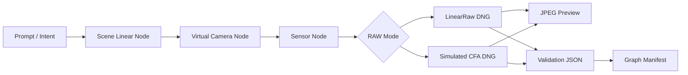

# RAW-native 節點式生成流程

本文件是 `image2dng` 從「既有影像轉 synthetic DNG」走向「AI 生成流程原生產出 synthetic RAW/DNG」的設計備忘。

## 核心判斷

短期先自建 repo 內的最小節點式 pipeline，而不是直接把 ComfyUI 安裝成核心依賴。

理由：

- RAW/DNG 語意、XMP provenance、synthetic camera 標示、validation contract 是本專案的核心責任，應先在本 repo 內保持可測試、可版本化、可回歸。
- 現有 `convert()`、DNG writer、validator、sensor effects 已經提供足夠基礎，可以快速拆成 graph artifacts。
- ComfyUI 很適合視覺化節點編排與生成模型生態，但若一開始綁為核心依賴，會讓 RAW 格式語意、模型工作流、UI extension 生命週期耦合過早。
- 第一批驗證目標是產生含 IFD0 JPEG preview 的 DNG、sidecar JPEG preview、validation JSON 與 graph manifest，不需要先引入大型 diffusion runtime。

ComfyUI 仍然是 Phase 2 整合目標。官方文件顯示 ComfyUI 具備 node/custom-node 與 CLI 管理路徑，適合之後包成 custom node 或由 API workflow 呼叫本 repo 的核心 pipeline：

- <https://docs.comfy.org/development/core-concepts/custom-nodes>
- <https://docs.comfy.org/comfy-cli/getting-started>
- <https://github.com/Comfy-Org/ComfyUI>

## 目標流程



## Artifact contract

每次 batch 至少輸出：

- `inputs/*-scene-linear.tif`：scene-linear RGB 中間影像。
- `raw/*-linearraw.dng`：三通道 synthetic LinearRaw DNG，預設包含 IFD0 JPEG preview 與 Raw SubIFD。
- `raw/*-cfa-rggb.dng`：single-channel simulated RGGB CFA DNG，預設包含 IFD0 false-color JPEG preview 與 Raw SubIFD。
- `jpeg/*-linearraw.jpg`：由 LinearRaw DNG raw page render 的 sidecar JPEG preview。
- `jpeg/*-cfa-rggb.jpg`：由 CFA DNG raw page false-color render 的 sidecar JPEG preview。
- `validation/*.json`：validator 結果。
- `manifests/raw-native-node-batch.json`：節點流程、輸入輸出、參數與驗證摘要。

## 目前實作

```powershell
uv run python scripts/generate_raw_native_batch.py --output-dir demo-output/raw-native-node-batch
```

目前節點：

- `PromptIntentNode`
- `SceneLinearGeneratorNode`
- `VirtualCameraLinearRawNode`
- `VirtualCameraCfaNode`
- `JpegPreviewRenderNode`
- `DngValidationNode`

目前的 scene generator 是 deterministic procedural generator，不是最終 AI diffusion model。這是刻意設計：第一階段先驗證 RAW-native pipeline 的檔案語意、manifest、DNG 可解析性、embedded preview layout 與 sidecar JPEG preview 交付流程。

目前 `raw-native-node-batch.json` 與 `sample-index.json` 已由 focused tests 固定為 contract。Demo review bundle 也會收斂 RAW-native DNG、JPEG preview、validation JSON、manifest 與 compatibility evidence，供外部審查使用：

```powershell
uv run python scripts/generate_demo_review_bundle.py --output-dir demo-output/review-bundle
```

## 下一個 gate

1. 用代表樣本持續驗證 `preview-subifd` layout 在 RAW tools 中的行為；這是格式實驗，不直接宣稱完整 Adobe 相容。
2. 讓 pipeline 支援外部 scene-linear image producer，作為 future AI model adapter boundary。
3. 在 DNG tag contract 與 compatibility evidence 穩定後，再做 ComfyUI custom node 原型：輸入 prompt/scene-linear tensor，輸出 DNG path、sidecar JPEG path、manifest。
4. 若 ComfyUI custom node 穩定，再加入 ComfyUI 安裝與 smoke workflow 文件。
